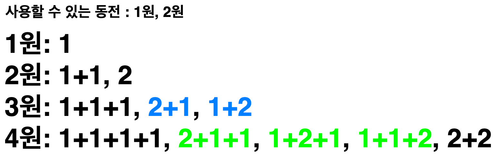
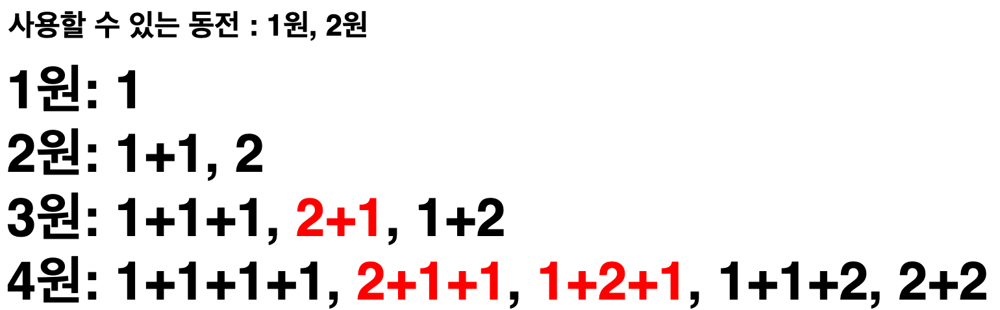

## ☘️ 문제

https://www.acmicpc.net/problem/2293

## ☘️ 풀이

주어진 동전으로 원하는 금액을 만드는 방법을 구하는 문제는 대표적인 dp 문제입니다. 하지만 이 문제에서 한 가지 조건이 있는데, 사용하는 동전의 구성은 같고 순서만 다른 경우는 모두 같은 경우라는 것입니다.

예를 들어, 사용할 수 있는 동전이 1원과 2원이 있다고 해보겠습니다.

<figure>
    
</figure>

여기서 같은 색으로 표시된 부분은 모두 중복되는 부분들입니다. 이 문제에서는 이런 부분들을 모두 한 가지의 경우로 보아야 합니다.

한 번 사용한 동전은 다시 사용하지 않는 방법으로 중복을 피할 수 있습니다. 이전 금액에서 1원을 추가해 3원을 만들었으면, 나중에 또다시 1원을 추가해 3원을 만들면 안됩니다.

<figure>
    
</figure>

1원짜리 동전을 추가해서 3원을 만들고, 2원짜리 동전을 추가해서 3원을 만든 다음에 다시 1원짜리 동전을 추가해서 3원을 만들면 안된다는 것입니다. 위 그림에서 빨간색으로 표시된 부분들이 다시 1원짜리 동전을 추가해서 3원, 4원을 만든 경우들입니다.(제외되어야 할 경우들입니다.)

그리고 2원짜리 동전을 추가해서 금액을 만드는 경우에는 1원짜리를 사용해서 만든 경우에 추가할 수 있습니다. 즉, 이전에 사용한 동전들로 만든 경우의 수를 활용하면 됩니다.

이렇게 구현하기 위해서 동전들을 순회하며 금액을 만들 수 있는 방법들을 구하면 됩니다.

## ☘️ 전체 코드 (파이썬)

```python
import sys

input = sys.stdin.readline


n, k = map(int, input().split())
coins = [int(input()) for _ in range(n)]
dp = [0] * (k + 1)
dp[0] = 1

for c in coins:
    for i in range(c, k + 1):
        dp[i] += dp[i - c]

print(dp[k])
```
