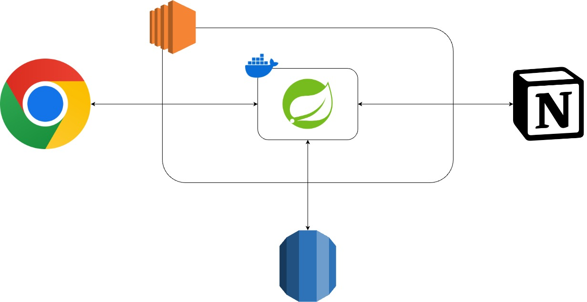
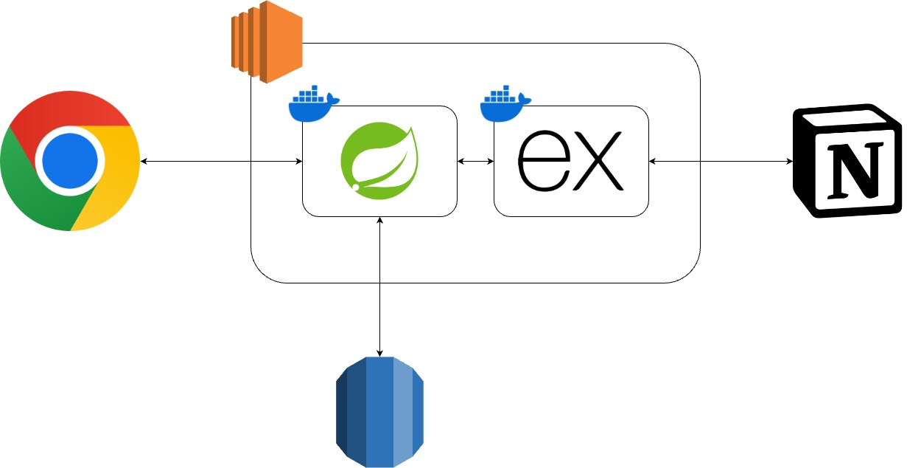

   

## 프로젝트 시작 계기

2023년 SSAFY를 다니면서 3번의 프로젝트를 진행했고, 2024년이 되면서 프로젝트보다는 알고리즘 문제 풀이나 CS 공부를 중심적으로 해야겠다고 생각했습니다. 포트폴리오에 쓸 프로젝트는 완성되었으니 실질적인 취업 준비를 하려고 했습니다.

어떻게 하면 좋은 포트폴리오를 작성하고 취업을 잘할 수 있을까 고민하던 중, 블로그 제목에 끌려 이동욱 님의 글 하나를 보게 되었습니다. (https://jojoldu.tistory.com/763) 본인에게 필요한 것을 만들어보고 실제 출시도 해보면서 배운 점을 정리하는 것이 곧 포트폴리오가 된다는 내용이었습니다. 이 글을 보고 프로젝트를 배척했던 마음을 접고, 그럼 나한테 필요한 서비스가 뭐가 있을까 생각했습니다.

저는 알고리즘 문제를 풀 때, 다시 풀어보고 싶은 문제를 노션에 기록하고 있었습니다. 하지만, 문제 제목, 번호, URL 등등을 하나하나 직접 옮겨 적으려니 불편한 점들이 많았습니다. 또한, 저장된 문제들을 다시 풀고자 했을 때, 문제를 랜덤으로 뽑아줬으면 좋겠다고 생각했었습니다. 이 점을 개선하고자 whileTrue 프로젝트를 시작하게 되었습니다.

## 시작하기 전, 고민한 부분

### 자바스크립트 vs. 타입스크립트

확장 프로그램의 개발 언어를 선택해야 했습니다. 자바스크립트로 진행할 경우, 이전에 사용해 본 경험이 있기 때문에 개발 진행이 상대적으로 더 빠를 것이라 생각되었습니다.

그에 반해 타입스크립트로 진행하면 사용해 본 경험이 없기에 프로젝트 진행이 늦어질 것 같았습니다. 하지만 SSAFY 프로젝트의 프론트엔드 팀원들이 모두 타입스크립트를 사용하면서 궁금하기도 했고, 한번 경험해보고 싶다고 생각했기에 타입스크립트를 선택하게 되었습니다.

### 리액트를 사용할 것인가?

굳이 리액트를 사용하지 않고도 확장 프로그램을 개발할 수 있습니다. 리액트 역시 경험이 없기 때문에 선택하는 데에 고민이 되었습니다.

리액트를 선택하면 다음과 같은 이점이 있었기에 고민이 되었고 결국 리액트를 선택하게 되었습니다.

1. 보일러 플레이트가 있다.

   구글이나 GitHub에 검색하시면 크롬 확장 프로그램 개발을 위한 리액트 보일러 플레이트를 여럿 보실 수 있습니다. 이를 활용하여 확장 프로그램 구조 조금 더 쉽게 파악을 할 수 있었고 코드 관리를 더 잘할 수 있을 것 같았습니다.

2. 화면 디자인이 더 수월하지 않을까? (추측)

   아무래도 리액트는 프론트엔드 라이브러리다 보니 화면을 디자인하고 다루는데 더 수월할 것 같다는 생각했습니다.

3. 한번 해볼까?

   SSAFY에서 진행한 3번의 프로젝트 모두 자바 스프링 백엔드 역할을 맡았습니다. 리액트를 사용해 본 적이 없었기에 이번 기회에 한번 써보고자 했습니다.

### 어떤 데이터베이스를 사용할 것인가?

처음에는 노션 데이터베이스를 활용하고자 했으나 진행하면서 꼭 노션이어야 하는 의문이 들었습니다. 노션 API를 다루기도 쉽지 않았고, 다시 풀고 싶은 문제를 저장하고 랜덤으로 추출하는 것이 중요하지 노션이어야 할 필요가 있을까라는 생각이 들었습니다. 더욱이 사용자가 데이터베이스 칼럼을 조작하지 못하기에 에러 핸들링이 간단해지는 이점도 있었습니다.

하지만, 결국 다시 노션을 선택하게 되었습니다. 사용자들이 자신이 저장한 모든 문제를 볼 수 있어야 한다고 생각했습니다. 단순히 저장하고 하나씩 추출하는 것을 넘어 사용자들이 지금까지 쌓아온 문제들을 보는 것도 의미가 있을 것이라 판단했습니다. 모든 문제를 보여주는 것은 노션이 아니어도 가능하겠지만, 노션을 활용하는 것이 사용자들에게 색다른 경험을 제공하고 또 웹페이지에서 보는 것보다는 자신의 노션에서 보는 게 접근성이 좋을 것이라 생각했습니다.

## 발생한 문제와 해결 방법

### 노션 API는 CORS를 지원하지 않는다.

프로젝트 초반에는 단순 확장 프로그램 단독으로 동작하는 것으로 구상했습니다. 하지만, 확장 프로그램에서 직접 노션 API를 사용하려고 하니 CORS 에러가 발생했습니다. 구글링을 통해 노션 API는 CORS를 지원하지 않는다는 것을 알게 되었습니다.

결국 백엔드까지 구축해야 된다는 것을 알게 됐고, 이 이후부터 프로젝트의 규모가 매우 커졌습니다…

### 자바에서 JSON을 다루기가 만만치 않다.

초기 다이어그램은 위와 같습니다. 지금까지 스프링 부트로 백엔드 프로젝트를 진행해 왔기에 큰 고민 없이 스프링을 선택했습니다. 하나의 스프링 서버에서 인증, 인가를 포함한 비즈니스 로직 처리, 데이터베이스 접근과 노션 API와의 통신 등등을 담당했습니다.

그러나 노션 API를 자바에서 사용하는데 불편함이 굉장히 많았습니다. JSON 형식으로 통신을 하는데 일일이 DTO를 만들어야 했고, 또 JSON의 깊이가 깊어 값을 받아오더라도 사용하는 데에 불편함이 많았습니다. 가장 큰 문제는 노션 API에서 반환되는 JSON의 키 값들이 고정되어 있지 않다는 것입니다.

스프링에서 노션을 사용한 모든 DTO를 만드는 등의 작업은 마쳤지만, 이후 이 코드를 계속 사용하고 유지보수하기에는 어려울 것 같았습니다. 실제로 개발 도중, “난이도” 칼럼도 같이 저장해 달라는 요구 사항을 받고, 노션 API를 사용하는 부분을 수정해야 했는데 코드가 너무 복잡했고 큰 스트레스로 다가왔습니다. 결국 노션 API 사용하기 위한 Express 서버를 도입하기로 했습니다.

최종적인 시스템 아키텍처는 위와 같습니다. 자바스크립트(타입스크립트)를 활용하면 쉽게 JSON를 다룰 수 있기에 보다 편리하게 노션 API를 다룰 수 있었습니다. 비록 관리해야 하는 프로젝트가 총 3개(확장 프로그램, 스프링 백엔드, Express 백엔드)가 되었지만, 자바로 변화무쌍한 JSON 객체들을 다루지 않아도 된다는 이점이 더 크게 느껴졌습니다.

이제 스프링 서버에서는 인증, 인가와 비즈니스 로직, 데이터베이스 접근의 역할을 맡게 되었고, 노션과 통신하는 부분은 Express 서버에서 맡게 되었습니다.

### 어떻게 문제를 랜덤으로 뽑지?

노션 API에는 데이터베이스에서 랜덤으로 뽑아주는 API가 없습니다. 처음에는 직접 데이터베이스에서 랜덤으로 선택해서 가져오는 방식으로 개발을 진행했습니다. 검색해 보시면 노션 데이터베이스에서 랜덤 값을 생성하는 방법들이 나옵니다. Formula 칼럼을 추가하여 랜덤 값을 생성하는 식을 넣으면 주기적으로 각 칼럼의 값이 랜덤값이 생성됩니다. (참고: https://medium.com/@andrewwongai/how-to-make-a-random-shuffle-gallery-view-in-notion-c1faf915c285)

이를 활용하여 이 값으로 정렬한 후, 첫 번째 값을 반환하는 방법으로 구현했었습니다. 하지만, 사용자 경험 차원에서는 별로 좋지 않겠다는 생각을 했습니다. 사용자 입장에서는 필요 없는 정보인데 사용자의 노션에 있는 것이 보기 좋지 않을 것 같았습니다. 그리고 사용자가 기존 자신의 데이터베이스를 사용하는 경우에는 사용자가 직접 칼럼과 랜덤값을 생성하는 식을 넣어줘야 합니다. 랜덤값 칼럼이 없는 경우도 따로 에러 핸들링을 해야 했기 때문에 다른 방식을 택하게 되었습니다.

그래서 현재 구현된 방식은 모든 문제를 가져와서 그중 랜덤 인덱스의 문제를 가져오는 방식입니다. 이로 인해 사용자 입장에서는 필요 없는 랜덤값 칼럼을 유지할 필요가 없어지고, 제 입장에서도 에러 핸들링을 하지 않아도 되어 관리하기 편해졌습니다. 랜덤 추출할 때마다 노션에서 모든 문제를 가져오는 것은 코스트가 많이 들 것이라 사용자의 로컬에 문제 리스트를 모두 저장하고 로컬에서 추출하는 방식으로 구현했습니다.

## 남아있는 숙제

1. 스프링 서버 재고

   이쯤 되니 굳이 스프링 서버가 있어야 하나라는 생각이 듭니다. 아직은 Express에 자세히 알지 못해 스프링 서버를 대체할 수 없지만, 이후 Express에 대해 좀 더 공부를 하고 스프링 서버를 대체하지 않을까 싶습니다.

2. 에러 핸들링

   데이터베이스 공유와 같은 필수적인 에러 핸들링은 구현되어 있으나 이외는 아직 러프하게 되어있습니다. 이 부분을 더 세분화하여 사용자에게 더 자세히 에러를 알려주는 방식으로 진행할 것 같습니다.

3. 비용

   이건 아마 해결하지 못할 숙제일 듯합니다. 프로젝트를 오래 유지하기 위해 처음에는 비용이 발생하지 않는 방법으로 진행하려고 했습니다. 이런 이유로 확장 프로그램으로만 동작하는 방식으로 시작했습니다. 하지만 결국 AWS EC2, RDS, Codedeploy 등까지 사용하면서 비용이 발생하게 되었습니다. 프로젝트를 계속 유지시키기 위해서는 비용을 최소화해야 하기에 계속 고민할 것 같습니다.

## 배우고 느낀 점

1. 타입스크립트와 리액트

   이번에 사용해 보면서 자바스크립트와 자바를 합친 것 같다는 느낌을 받았습니다. 필요한 부분에서는 객체 interface나 type을 지정해 주어 사용할 때 내부 값들의 접근이 쉬웠습니다. interface나 type이 복잡한 경우에는 `any`를 써서 회피할 수 있는 것도 사용하는 데에 편리했습니다. 물론 깊게 써보지는 않았지만, 자바스크립트보다는 타입스크립트를 쓰는 게 더 도움 되지 않을까 싶습니다.

   리액트를 사용하면서 리액트로 시작하기 잘했다는 생각을 했습니다. 개발하다 보니 꽤 많은 화면을 만들고 조건부 랜더링을 해야 했습니다. 단순 HTML로 다뤘으면 중복되는 내용도 많고 로직을 다루기도 쉽지 않았을 것 같습니다. 이번 개발에 필요한 리액트 개발 방법만 익혀 사용했기에 제대로 알지는 못하지만, 화면별로 분리하고 관리하기 편하다고 느꼈습니다.

2. 공식 문서와 친해졌다.

   이번 프로젝트를 진행하면서 크롬 개발자 문서와 노션 개발자 문서 참고를 많이 했습니다. 이전에는 공식 문서를 봐야 된다는 것을 알아도 가독성이 좋지 않다는 이유로 계속 기피했습니다. 하지만, 크롬 개발자 문서나 노션 API 문서는 정리도 잘 되어있기도 했고 사용한 레퍼런스도 많지 않아 공식 문서를 계속 참고했습니다. 이번 기회를 통해 공식 문서와 친해지지 않았나 생각합니다.

3. 개발을 들어가기 전에 사전 조사를 자세히 해야겠다.

   발생한 문제에서 말한 것처럼 진행하면서 아키텍처나 구현 방식을 여러 번 갈아엎었습니다. 단순 확장 프로그램만 개발한다는 첫 구상에서 백엔드, 데이터베이스, 서버, CI/CD까지 규모가 매우 커졌습니다. 물론 왕도로만 갈 수는 없겠지만, 그래도 사전에 알아보고 어느 정도 구상을 해봤으면 시간을 더 많이 아낄 수 있지 않았을까 하는 아쉬움이 남습니다.

4. 실제 사용자를 받는다는 두려움

   단순히 프로젝트를 만들고 끝나는 것이 아니라, 실제로 다른 사람들이 내 프로젝트, 서비스를 사용한다고 하니 막연한 두려움이 생기고 더 잘 만들어야 하는 것 아닌가라는 생각이 들었습니다. 아직도 이런 마음이 없는 것은 아니지만, 개선해 나가면서 성장하는 것이고 또, 오픈 소스로 다 같이 만들어나가는 것이라 생각하며 완성했습니다. 그리고 안정적인 서비스를 만들기 위해 공부를 많이 해야겠다는 다짐하게 됐습니다.

5. SSAFY를 통한 성장

   사실 백엔드 기술 스택에 꽤 여러 개가 사용되었습니다. AWS의 EC2, RDS, Codedeploy, GitHub Actions, Docker, Spring, Express 등등을 도입했습니다. SSAFY의 프로젝트를 통해 경험을 이미 해보았고 사용 방법들을 알고 있었기에 큰 진입 장벽, 고민 없이 도입할 수 있었던 것 같습니다.

6. 출시될 때의 뿌듯함

   초반에 개발을 시작하면서 제대로 완성할 수 있을까라는 의구심이 들었습니다. 개발을 하면서도 몇 번의 큰 문제가 발생할 때마다 포기하고 싶다, 괜히 시작했나라는 생각이 들었습니다. 그래도 차근차근 하나씩 해결해나가다 보니 완성시킬 수 있었습니다. 그리고 크롬 웹 스토어의 승인을 받고 정식 출시가 되었을 때 굉장히 뿌듯했습니다.

## 글을 마무리하며…

앞으로 조금씩 프로젝트를 개선해 나갈 생각입니다. 상반기 채용 공고들이 나오고 있어서 큰 변화를 주지는 못하겠지만, 에러 수정 등은 꾸준히 할 예정입니다.

마지막으로 프로젝트를 진행하는 데에 도움을 주신 분들께 감사 인사를 남기고 마무리하겠습니다. 먼저, ‘프로젝트는 이제 그만’이라는 닫힌 생각을 다시 열게끔 인사이트를 주신 이동욱 님께 감사드립니다. 덕분에 프로젝트를 시작할 수 있었습니다. 프로젝트에 “whileTrue”라는 이름을 붙여주시고, 페르소나가 되어주신 심부부 님, 적극적으로 의견을 내주시고 프로젝트를 지속할 수 있도록 응원해 주신 햄 님, 그리고 고민이 생기거나 결정 사항이 생길 때마다 고민 들어주시고 의견 주신 변 님까지 모두들 감사합니다.

## 관련 링크

- [GitHub](https://github.com/modisfive/whileTrue)
- [크롬 웹 스토어](https://chromewebstore.google.com/detail/whiletrue/ockglcdfpkebaiaaocinjdcpiieceocn)
