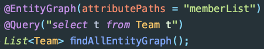

## N+1 문제가 뭘까?

하나의 엔티티 전체를 조회하면서 그와 연관된 다른 엔티티를 조회할 때, 여러 번의 쿼리가 발생하는 문제입니다. 예를 들어, Team 엔티티와 Member 엔티티 사이에 다음과 같이 1:N(일대다)의 관계가 있다고 해보겠습니다.

<figure>
    
</figure>

그리고 각각의 엔티티는 다음과 같이 정의되어 있습니다.

```java
@Getter
@Entity
@NoArgsConstructor
@Builder
@AllArgsConstructor
public class Member {

    @Id
    @GeneratedValue(strategy = GenerationType.IDENTITY)
    @Column(name = "member_id")
    private Long id;

    private String name;

    @ManyToOne
    @JoinColumn(name = "team_id")
    private Team team;

    public void joinNewTeam(Team team) {
        this.team = team;
    }

}
```

```java
@Getter
@Entity
@NoArgsConstructor
public class Team {

    @Id
    @GeneratedValue(strategy = GenerationType.IDENTITY)
    @Column(name = "team_id")
    private Long id;

    private String name;

    @OneToMany(mappedBy = "team", cascade = CascadeType.ALL, fetch = FetchType.LAZY)
    private List<Member> memberList = new ArrayList<>();

    @Builder
    public Team(Long id, String name, List<Member> memberList) {
        this.id = id;
        this.name = name;
        if (memberList != null) {
            this.memberList = memberList;
        }
    }

    public void addNewMember(Member member) {
        this.memberList.add(member);
        member.joinNewTeam(this);
    }
}
```

총 3개의 팀이 있고, 각 팀에는 3명의 멤버가 있습니다.

```java
@BeforeEach
public void setup() {
    List<Team> teamList = new ArrayList<>();

    for (int i = 0; i < 3; i++) {
        Team team = Team.builder().name("팀 " + i).build();

        for (int j = 0; j < 3; j++) {
            team.addNewMember(Member.builder().name("멤버 " + i + j).build());
        }

        teamList.add(team);
        teamRepository.saveAll(teamList);
    }
}
```

```java
@Service
@RequiredArgsConstructor
public class TeamService {

    private final TeamRepository teamRepository;

    @Transactional
    public List<String> findAllMemberNameFromAllTeam() {
        System.out.println("\n========== 모든 팀 조회 ==========");
        List<Team> teamList = teamRepository.findAll();

        return findAllMemberName(teamList);
    }

    private List<String> findAllMemberName(List<Team> teamList) {
        System.out.println("\n========== 각 팀의 멤버 조회 ==========");

        List<String> nameList = new ArrayList<>();
        for (Team team : teamList) {
            nameList.addAll(team.getMemberList().stream().map(Member::getName).toList());
        }
        return nameList;
    }
}
```

우리는 모든 팀을 조회하고 각 팀에 속해 있는 모든 멤버들의 이름을 가져오고 싶습니다. 이것을 하나의 쿼리로 처리하고 싶지만 실제 실행된 쿼리를 보면 여러 쿼리가 동작한다는 것을 알 수 있는데, 이것이 N+1 문제입니다.

<figure>
    
</figure>

처음에 모든 팀을 가져오는 쿼리가 실행되고(1), 총 N개의 팀을 가져오게 됩니다. 그리고 각 팀의 멤버들에 접근해야 하기 때문에 또 다시 각 팀에 대해서 쿼리가 실행됩니다.(N)

우리의 예제에서는 총 3개의 팀이 있기 때문에, 모든 팀을 조회하는 쿼리 1개와 3개의 각 팀의 멤버들에 접근하는 쿼리 3개가 실행되는 것을 볼 수 있습니다.

## 무엇이 문제인데?

우리는 각 팀에 속해 있는 모든 멤버들의 이름을 가져오고 싶습니다. 하지만 기존의 방식대로 하면 팀들을 조회하는 쿼리와 각 팀의 멤버들을 조회하는 쿼리가 따로 나가기 때문에 문제가 됩니다. 위에서 든 예시에서는 팀의 수가 매우 적기 때문에 추가적으로 실행되는 쿼리의 수가 적지만, 만약 팀의 수가 매우 많은 경우에는 팀의 수만큼 쿼리가 실행되기 때문에 성능에 큰 문제가 될 수 있습니다.

따라서, 쿼리가 따로 실행되는 것이 아니라 한 번의 쿼리로 팀의 정보와 각 팀들의 정보를 가져오는 방법이 없는지 고민해보아야 합니다.

## 왜 발생할까?

N+1 문제가 왜 발생할까요? 그럼 반대로 생각해보겠습니다. N+1 문제가 발생하지 않도록 하려면 JPA가 어떻게 동작해야 할까요?

모든 팀의 조회하는 쿼리와 함께 각 팀에 연관된 엔티티도 모두 조회하는 쿼리도 포함시켜서 한 번에 처리하고 전부 영속성 컨텍스트에 저장해야 합니다. 하지만, JPA가 기본적으로 이렇게 동작한다면 이 역시도 큰 문제가 될 것입니다.

## FetchType.LAZY(지연 로딩)을 하면 괜찮지 않을까?

JpaRepository의 메소드들은 JPQL로 실행되는데, JPQL은 Fetch 전략과 상관없이 일단 SQL로 변환되어 실행됩니다. 즉시 로딩, 지연 로딩 같은 글로벌 Fetch 전략과 상관없이 일단 모든 팀의 정보를 가져옵니다. 그 이후에 JPA는 엔티티에 설정된 Fetch 전략에 따라 연관된 엔티티를 바로 가져올지 말지 판단합니다.

따라서, N+1 문제는 즉시 로딩이나 지연 로딩과 상관 없습니다. `FetchType.EAGER`인 경우에는 모든 팀을 조회하는 쿼리가 수행된 이후에 추가적인 쿼리도 바로 연이어 나가고, `FetchType.LAZY`인 경우에는 추가 쿼리가 바로 나가지는 않지만, 각 팀에 접근해서 멤버들을 조회할 때 쿼리가 나가게 됩니다.

즉, 즉시 로딩이나 지연 로딩은 연관된 엔티티를 가져오는 쿼리가 언제 나가느냐에 차이가 있을 뿐, 결과적으로 둘 다 추가적인 쿼리를 통해서 연관된 엔티티를 가져옵니다.

## 그럼 어떻게 해결하지?

대표적인 해결 방법으로는 Fetch Join, @EntityGraph, BatchSize를 이용하는 방법이 있습니다.

## Fetch Join

- 코드 블럭으로 보기
  ```java
  @Query("select t from Team t join fetch t.memberList")
  List<Team> findAllFetchJoin();
  ```
  ```sql
  select
      team0_.team_id as team_id1_1_0_,
      memberlist1_.member_id as member_i1_0_1_,
      team0_.name as name2_1_0_,
      memberlist1_.name as name2_0_1_,
      memberlist1_.team_id as team_id3_0_1_,
      memberlist1_.team_id as team_id3_0_0__,
      memberlist1_.member_id as member_i1_0_0__
  from
      team team0_
  inner join
      member memberlist1_
          on team0_.team_id=memberlist1_.team_id
  ```

Fetch Join은 일반 SQL에서 제공하는 기능이 아닌, JPQL에서 성능 최적화를 위해 제공하는 기능입니다. Fetch Join을 사용하면 연관된 엔티티나 컬렉션을 한 번의 SQL 쿼리로 가져올 수 있습니다.

<figure>
    
</figure>

<figure>
    
</figure>

그리고 위 사진에서 볼 수 있다시피 Fetch Join은 Inner Join으로 수행됩니다.

## @EntityGraph

- 코드 블럭으로 보기
  ```java
  @EntityGraph(attributePaths = "memberList")
  @Query("select t from Team t")
  List<Team> findAllEntityGraph();
  ```
  ```sql
  select
      team0_.team_id as team_id1_1_0_,
      memberlist1_.member_id as member_i1_0_1_,
      team0_.name as name2_1_0_,
      memberlist1_.name as name2_0_1_,
      memberlist1_.team_id as team_id3_0_1_,
      memberlist1_.team_id as team_id3_0_0__,
      memberlist1_.member_id as member_i1_0_0__
  from
      team team0_
  left outer join
      member memberlist1_
          on team0_.team_id=memberlist1_.team_id
  ```

@EntityGraph의 `attributePaths`에 쿼리 수행 시에 같이 가져올 필드명을 지정하면 한 번에 모두 가져오게 됩니다.

<figure>
    
</figure>

<figure>
    
</figure>

주목할 점은 Fetch Join은 Inner Join으로 수행되는 반면, @EntityGraph는 Outer Join으로 수행된다는 것입니다.

## Fetch Join과 @EntityGraph의 문제점

1. 단순 Fetch Join만을 사용하면 카테시안 곱이 발생하기 때문에 일대다 관계의 일(1) 부분에서 중복 발생하게 됩니다.

   ```java
   @Test
   void joinFetch() {

       System.out.println("\n========== Fetch Join 테스트 ==========");
       System.out.println("\n========== 모든 팀 조회 ==========");

       List<Team> allTeams = teamRepository.findAllFetchJoin();

       System.out.println("\n========== 모든 팀 조회 끝 ==========");
       System.out.println("\n========== 각 팀의 멤버 조회 ==========");

       List<String> allMemberNames = new ArrayList<>();
       for (Team team : allTeams) {
           System.out.println(team.getName());
           for (Member member : team.getMemberList()) {
               System.out.println(member.getName());
               allMemberNames.add(member.getName());
           }
       }

       System.out.println("\n========== 각 팀의 멤버 조회 끝 ==========");
       System.out.println("allTeams = " + allTeams.size());
       System.out.println("allMemberNames = " + allMemberNames.size());

   }
   ```

   <figure>
    
   </figure>

   <figure>
    
   </figure>

   이를 해결하기 위해서는 JPQL의 DISTINCT 키워드를 사용하거나 Set 컬렉션을 이용해서 중복되는 값을 제거해야 합니다.

   ```java
   @Query("select distinct t from Team t join fetch t.memberList")
   List<Team> findAllDistinctFetchJoin();
   ```

   ```java
   @EntityGraph(attributePaths = "memberList")
   @Query("select distinct t from Team t")
   List<Team> findAllDistinctEntityGraph();
   ```

   ```java
   // Set을 이용하는 경우

   @Query("select t from Team t join fetch t.memberList")
   Set<Team> findAllFetchJoinBySet();
   ```

2. 페이징 처리가 어렵습니다. Fetch Join과 @EntityGraph에서는 페이징 API를 지원하지 않기 때문에 페이징 처리를 할 수 없습니다.

## BatchSize

BatchSize 값을 설정하면 한 번의 쿼리로 연관된 데이터 몇 개를 가져올 지를 지정할 수 있습니다. 예를 들어 70개의 가져올 데이터가 있고 BatchSize가 30인 경우, 총 3번의 쿼리로 30개, 30개, 10개씩 가져오게 됩니다. 하나의 쿼리로 모든 데이터를 조회할 수는 없지만(전체 데이터 수가 BatchSize보다 큰 경우), 기존의 N+1 문제에서 발생한 쿼리 수보다는 적게 발생합니다.

## 참고

- [[블로그] JPA N+1 문제 및 해결방안 (향로 님)](https://jojoldu.tistory.com/165)
- [[블로그] JPA N+1 발생 케이스와 해결책 (최진영 님)](https://brunch.co.kr/@jinyoungchoi95/2)
- [[인프런 강의] 자바 ORM 표준 JPA 프로그래밍 - 기본편 (김영한 님)](https://www.inflearn.com/course/ORM-JPA-Basic)
