## 문제 발생

whileTrue 서비스를 쓰고 있는데 어느 순간부터 크롬 확장 프로그램이 제대로 동작하지 않았습니다. 콘솔을 보니 다음과 같은 에러 메시지가 출력되고 있었습니다.

<figure>
    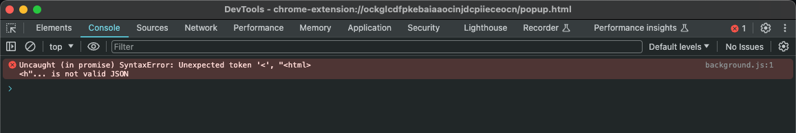
</figure>

에러 메시지를 자세히 보니 반환된 메시지를 JSON으로 변환하려다가 문제가 생긴 것 같았습니다. 여기서 "아! JSON 객체가 넘어온 것이 아니구나!"를 깨닳았습니다. 그래서 백엔드에서 반환된 메시지를 그냥 출력시켜봤는데..

<figure>
    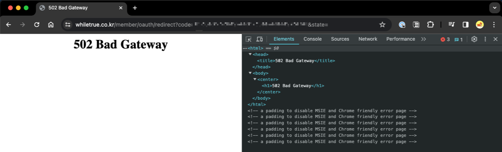
</figure>

이렇게 502 Bad Gateway를 반환하고 있었습니다.

음.. 당연히 비즈니스 로직 상의 Spring Boot 서버가 502를 반환할 리는 없고.. 그렇다고 EC2에서 반환할 리가 없을 것 같은데.. 다른 인프라가 있나? 라고 생각한 순간 머리 속을 스쳐간 것이 AWS의 ALB입니다. 이전에 도메인을 연결하면서 ALB를 설정했었는데 거기서 잘못됐나보다라고 생각하게 됐습니다.

AWS에서 ALB 모니터링을 보니 502를 반환하고 있던 것을 확인했습니다.

<figure>
    
    <figcaption>ALB 모니터링</figcaption>
</figure>

## 문제 알아보기

구글에 AWS ALB가 502를 반환하는 경우를 검색해보았는데, 꽤나 많은 자료들이 있었습니다.

우선, ALB의 로그를 확인해보기로 했습니다. 로그 확인 방법은 아래의 블로그를 참고하여 진행했습니다.

- https://docs.aws.amazon.com/ko_kr/athena/latest/ug/application-load-balancer-logs.html
- https://inpa.tistory.com/entry/AWS-%F0%9F%93%9A-ELBALB-%EB%A1%9C%EA%B7%B8-%ED%99%9C%EC%84%B1%ED%99%94-S3%EC%97%90-%EB%A1%9C%EA%B7%B8-%EC%A0%80%EC%9E%A5%ED%95%98%EA%B8%B0
- https://velog.io/@jiyeon_hong/AWS-Athena%EB%A5%BC-%EC%9D%B4%EC%9A%A9%ED%95%9C-ALB-Access-Log-%EB%B6%84%EC%84%9D-%EB%B0%A9%EB%B2%95
- https://metaverse-cloud.tistory.com/264

생성된 로그에서 status code가 502인 경우들을 모두 검색했습니다.

<figure>
    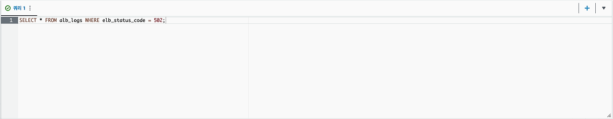
    <figcaption>status_code가 502인 경우 검색</figcaption>
</figure>

<figure>
    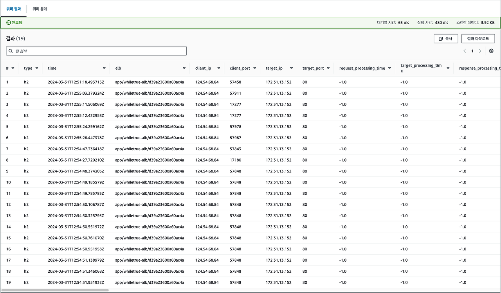
    <figcaption>검색 결과</figcaption>
</figure>

여기서 request_processing_time, target_processing_time, response_processing_time 모두 -1인 것을 확인할 수 있습니다. AWS 문서에서는 이 경우에 대한 원인을 알려주고 있었습니다.

<figure>
    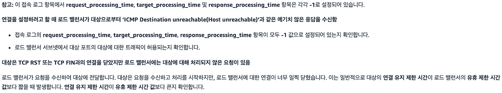
    <figcaption>출처: https://repost.aws/ko/knowledge-center/elb-alb-troubleshoot-502-errors</figcaption>
</figure>

<figure>
    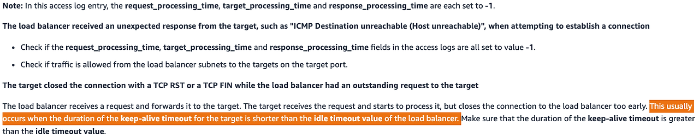
    <figcaption>영문이 좀 더 명시적으로 해결해주는 듯하다.</figcaption>
</figure>

"_대상의 연결 유지 제한 시간이 로드 밸런서의 유휴 제한 시간보다 짧을 때 발생합니다._"라고 나와 있습니다.

### HTTP 502 상태 코드란?

RFC 7231 문서에서는 다음과 같이 설명하고 있습니다.

<figure>
    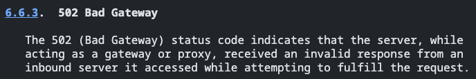
    <figcaption>출처: https://datatracker.ietf.org/doc/html/rfc7231#section-6.6.3</figcaption>
</figure>

게이트웨이나 프록시 서버에서 백엔드 서버로 응답을 요청했는데, 유효하지 않은 응답을 받은 경우 반환한다고 합니다. 우리 같은 경우는 ALB에서 Spring 서버로 요청을 했는데, Spring 서버에서 유효하지 않은 응답을 보내온 경우로 볼 수 있습니다.

### keep-alive?

<figure>
    
    <figcaption>출처: https://ko.wikipedia.org/wiki/HTTP_%EC%A7%80%EC%86%8D%EC%A0%81_%EC%97%B0%EA%B2%B0_%EC%83%81%ED%83%9C</figcaption>
</figure>

HTTP 통신을 시작할 때 TCP의 3-way handshake를 진행합니다. HTTP 통신을 마무리할 때에는 4-way handshake를 진행합니다. 한 번의 HTTP 통신을 할 때마다 이 두 과정을 진행한다면 큰 overhead가 될 것입니다.

이런 낭비를 방지하기 위해 한 번 TCP Connection을 맺으면 여러 번 데이터를 주고 받게 할 수 있습니다. 이것이 HTTP Keep-Alive입니다.

(참고) http/1.0에서는 이 기능을 사용하기 위해서는 HTTP Header에 해당 설정을 명시해주어야 했지만, http/1.1부터는 굳이 명시하지 않아도 connection을 유지합니다.(기본으로 keep-alive가 설정되어있습니다.)

### connectionTimeout vs. keepAliveTimeout

- connectionTimeout : Client와 Server 간에 연결하는데 소요되는 최대 시간을 의미합니다. 즉, TCP 3-way handshake로 연결이 완료되기까지의 최대 시간이라 할 수 있습니다. 만약, 설정된 시간 내에 연결이 되지 않으면 timeout이 발생하게 됩니다.
- keepAliveTimeout : 통신 없이 IDLE 상태로 연결을 유지하는 시간으로, 다른 요청을 받기까지 기다리는 최대 시간을 의미합니다. 가장 최근에 받은 요청에서 설정된 시간 내에 다른 요청을 받지 않으면 연결을 끊게 됩니다.

### 그럼 왜 발생했을까?

<figure>
    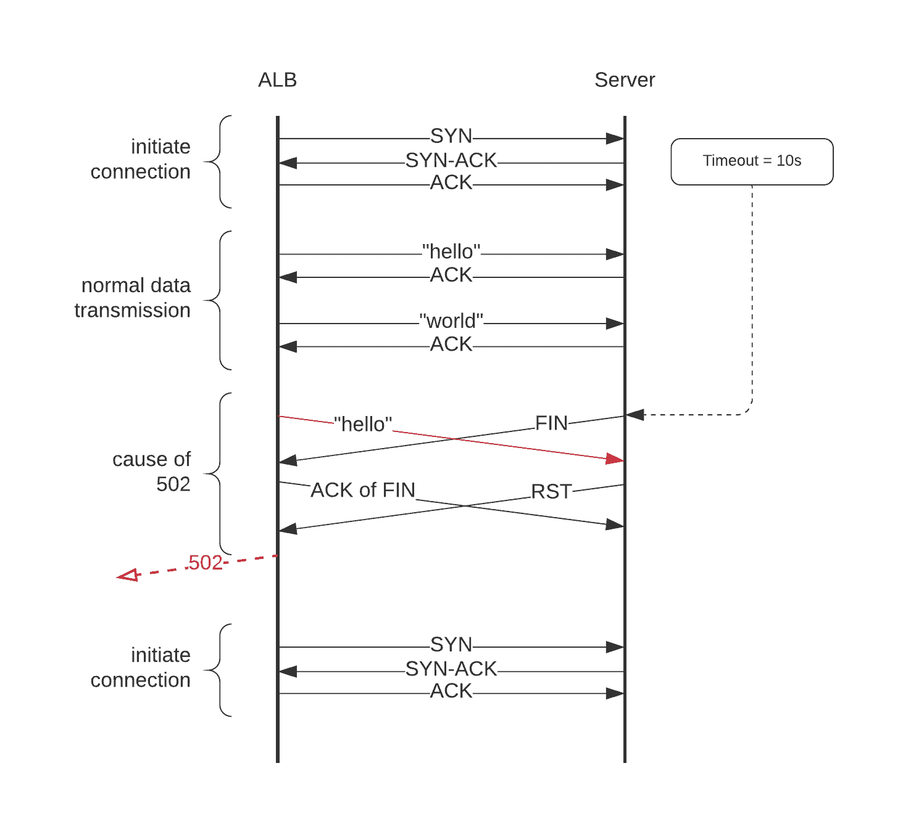
    <figcaption>출처: https://www.tessian.com/blog/how-to-fix-http-502-errors/</figcaption>
</figure>

AWS 문서에도 나왔다시피 Server에서 먼저 connection을 닫아버려서 그렇습니다. ALB에서는 아직 보낼 데이터가 있는데 Server에서 HTTP 연결을 마무리하는 FIN을 보내고 연결을 끝냈습니다. 닫힌 소켓에 대해 응답을 받을 수 없으니 Client에게는 502 상태 코드를 보내게 됩니다.

### request_processing_time, target_processing_time, response_processing_time

<figure>
    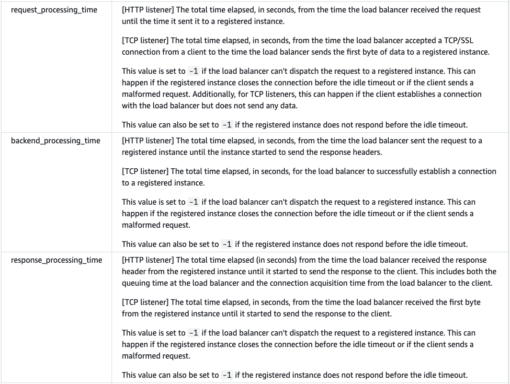
    <figcaption>출처: https://docs.aws.amazon.com/ko_kr/elasticloadbalancing/latest/classic/access-log-collection.html#access-log-entry-format</figcaption>
</figure>

- request_processing_time : ALB가 클라이언트에게서 요청을 받고, 연결된 인스턴스(EC2)에 요청하기까지 걸린 시간
  -1인 경우는 연결된 인스턴스가 유휴 시간 초과 이전에 연결을 닫은 경우일 수 있다고 합니다.
- target_processing_time : ALB가 연결된 인스턴스에 요청을 하고, 응답을 받기까지 걸린 시간
  -1인 경우는 역시 연결된 인스턴스가 유휴 시간 초과 이전에 연결을 닫은 경우일 수 있다고 합니다.
- response_processing_time : ALB가 연결된 인스턴스에게 응답을 받고, 클라이언트에게 응답하기까지 걸린 시간
  -1인 경우는 역시역시 연결된 인스턴스가 유휴 시간 초과 이전에 연결을 닫은 경우일 수 있다고 합니다.

## 문제 해결하기

<figure>
    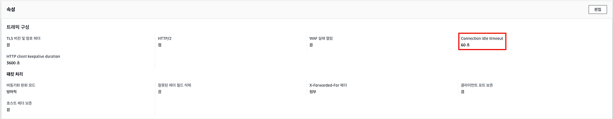
    <figcaption>Connection idle timeout : 60초</figcaption>
</figure>

ALB의 유휴 제한 시간은 60초입니다.

<figure>
    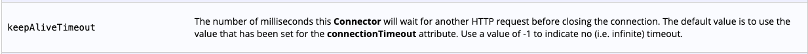
    <figcaption>기본값은 connectionTimeout 값과 같다.</figcaption>
</figure>

<figure>
    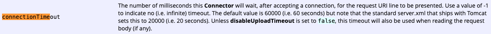
    <figcaption>connectionTimeout의 기본값은 20초이다.</figcaption>
</figure>

이에 반해 Spring Boot의 연결 유지 제한 시간은 20초입니다.

Spring Boot의 keep-alive-timeout을 70초(70000ms)로 늘려 최종적으로 해결했습니다.

<figure>
    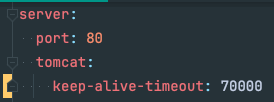
    <figcaption>application.yml에 다음과 같이 설정한다.</figcaption>
</figure>

## 참고

- https://velog.io/@haron/%EB%84%A4%ED%8A%B8%EC%9B%8C%ED%81%AC-AWS-ALB%EC%9D%98-HTTP-502-%EC%98%A4%EB%A5%98%EB%A5%BC-%ED%95%B4%EA%B2%B0%ED%95%B4%EB%B3%B4%EC%9E%90-dba4dfrv
- https://inpa.tistory.com/entry/AWS-%F0%9F%93%9A-ELBALB-%EB%A1%9C%EA%B7%B8-%ED%99%9C%EC%84%B1%ED%99%94-S3%EC%97%90-%EB%A1%9C%EA%B7%B8-%EC%A0%80%EC%9E%A5%ED%95%98%EA%B8%B0
- https://docs.aws.amazon.com/ko_kr/athena/latest/ug/application-load-balancer-logs.html
- https://docs.aws.amazon.com/elasticloadbalancing/latest/application/enable-access-logging.html
- https://repost.aws/ko/knowledge-center/elb-alb-troubleshoot-502-errors
- https://velog.io/@jiyeon_hong/AWS-Athena%EB%A5%BC-%EC%9D%B4%EC%9A%A9%ED%95%9C-ALB-Access-Log-%EB%B6%84%EC%84%9D-%EB%B0%A9%EB%B2%95
- https://devocean.sk.com/blog/techBoardDetail.do?ID=165428&boardType=techBlog
- https://metaverse-cloud.tistory.com/264
- https://tomcat.apache.org/tomcat-8.5-doc/config/http.html
- https://velog.io/@haron/%EB%84%A4%ED%8A%B8%EC%9B%8C%ED%81%AC-AWS-ALB%EC%9D%98-HTTP-502-%EC%98%A4%EB%A5%98%EB%A5%BC-%ED%95%B4%EA%B2%B0%ED%95%B4%EB%B3%B4%EC%9E%90-dba4dfrv
- https://www.tessian.com/blog/how-to-fix-http-502-errors/
- https://goodgid.github.io/HTTP-Keep-Alive/
